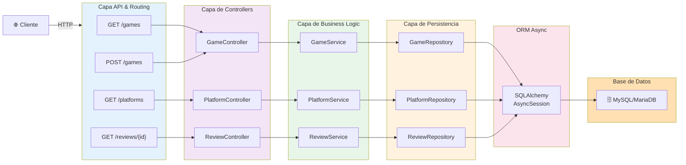
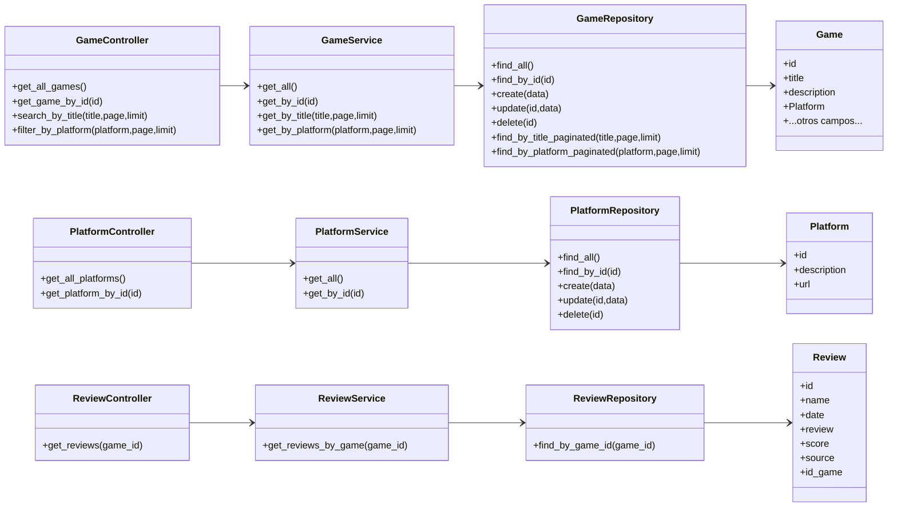
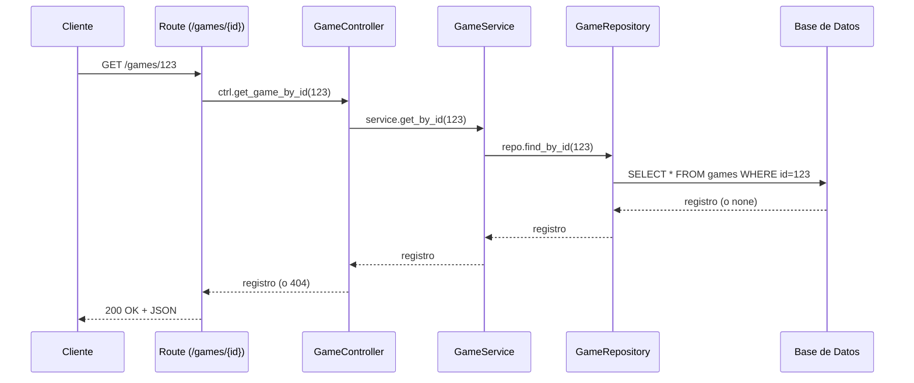
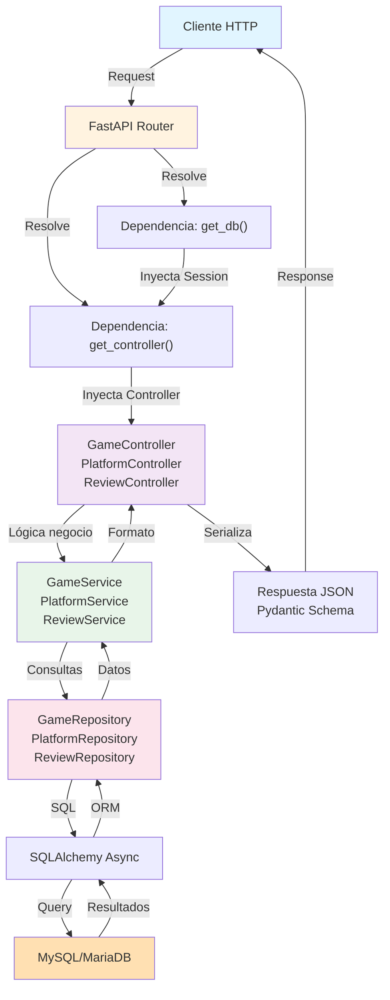
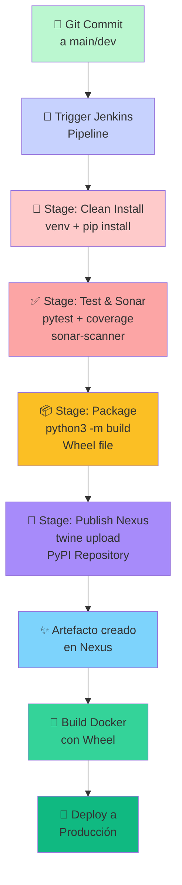
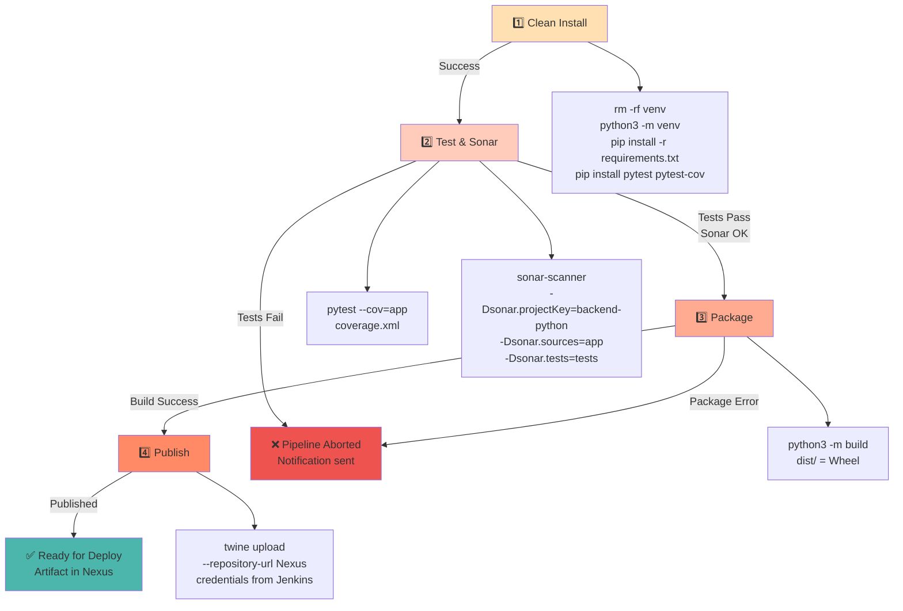
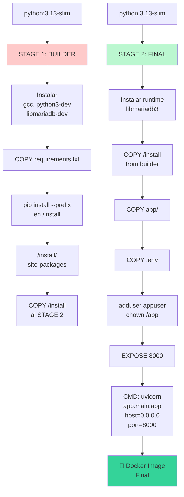

# Diagramas Visuales - Diseño del Proyecto

Este documento consolida todos los diagramas generados en formato visual para referencia rápida.

---

## 1️⃣ Diagrama de Capas de Arquitectura

**Descripción:** Muestra la estructura de capas jerárquica del sistema, desde el cliente HTTP hasta la base de datos.

- **Capa API & Routing:** Endpoints FastAPI
- **Capa Controllers:** Orquestación de solicitudes
- **Capa Business Logic:** Lógica de negocio y transformaciones
- **Capa Persistencia:** Acceso a datos (Repositories)
- **ORM Async:** SQLAlchemy para operaciones asincrónicas
- **Base de Datos:** MySQL/MariaDB



---

## 2️⃣ Diagrama de Clases UML

**Descripción:** Estructura estática de todas las clases del sistema y sus dependencias.



---

## 3️⃣ Diagrama de Secuencia - GET /games/{id}

**Descripción:** Flujo de ejecución paso a paso para una solicitud GET de un juego por ID.



---

## 4️⃣ Diagrama Entidad-Relación (ER)

**Descripción:** Modelo de datos relacional de la base de datos MySQL/MariaDB con todas las tablas y sus campos.

```mermaid
erDiagram
    GAMES ||--o{ REVIEW : "tiene"
    
    GAMES {
        int id PK
        string title
        text description
        int GameDBId
        string image_Large
        string image_Medium
        string image_Original
        string image_Front
        string Platform
        string Publisher
        string releasedate
        string players
        string genre
        string youtube_Trailer
        string youtube_Walk
        string wiki_url
        text wiki_page
        string youtube_ending
        string youtube_secrets
        string youtube_ost
        string youtube_speedrun
        string youtube_review
        string spotify_ost
        string ign_url
        string metacritic_url
        string metacritic_score
        string metacritic_scoreu
        string "3djuegos_url"
        string areajugones_url
        string meristation_url
        string "3djuegos_score"
        string opencritic_url
        string esrb_letter
        string esbr_message
    }

    PLATFORM {
        int id PK
        string description
        string url
    }

    REVIEW {
        int id PK
        string name
        string date
        text review
        string score
        string source
        int id_game FK
    }
```

---

## 5️⃣ Diagrama de Flujo HTTP

**Descripción:** Camino completo de una solicitud HTTP desde el cliente hasta la respuesta, mostrando cada capa involucrada.



---

## 6️⃣ Pipeline CI/CD de Jenkins

**Descripción:** Flujo completo desde un commit en Git hasta la publicación del artefacto en Nexus.



---

## 7️⃣ Etapas Detalladas del Pipeline

**Descripción:** Desglose de cada etapa con los comandos ejecutados y condiciones de éxito/fallo.



---

## 8️⃣ Dockerfile Multi-Stage Build

**Descripción:** Proceso de construcción de la imagen Docker en dos etapas (Builder y Final) para optimizar tamaño.



---

## 9️⃣ Infraestructura CI/CD Completa

**Descripción:** Ecosistema completo de herramientas: Jenkins, SonarQube, Nexus, Docker y ambiente de despliegue.

```mermaid
graph LR
    A["📚 Git Repository"]
    
    subgraph Jenkins["🔨 Jenkins CI/CD<br/>server"]
        B["Pipeline<br/>Executor"]
        C["Clean Install<br/>+ Venv"]
        D["Test Runner<br/>pytest"]
        E["Sonar Client"]
    end
    
    subgraph Quality["📊 Quality Gates"]
        F["SonarQube<br/>172.17.0.1:9000"]
        G["Coverage Report<br/>coverage.xml"]
    end
    
    subgraph Build["🏗️ Build & Package"]
        H["python -m build<br/>Wheel package"]
        I["twine upload"]
    end
    
    subgraph Registry["📦 Nexus 3<br/>172.17.0.1:8081"]
        J["PyPI Repository<br/>python-nexus-repo"]
    end
    
    subgraph Container["🐳 Container"]
        K["Docker Build<br/>Multi-stage"]
        L["Python:3.13-slim<br/>+ dependencies"]
    end
    
    subgraph Deploy["🚀 Deployment"]
        M["Docker Registry<br/>or Host"]
        N["Production/Test<br/>Environment"]
    end
    
    A -->|Webhook| Jenkins
    B --> C
    C --> D
    D --> E
    E --> F
    D --> G
    F -->|Pass/Fail| Build
    Build --> H
    H --> I
    I --> Registry
    Registry --> J
    J --> Container
    Container --> K
    K --> L
    L --> Deploy
    Deploy --> M
    M --> N
    
    style Jenkins fill:#fff3cd
    style Quality fill:#f8d7da
    style Build fill:#d4edda
    style Registry fill:#cfe2ff
    style Container fill:#e7d4f5
    style Deploy fill:#d1ecf1
```



---

## 📊 Resumen de Componentes

| Componente | Responsabilidad |
|---|---|
| **FastAPI Router** | Mapeo de rutas HTTP y resolución de dependencias |
| **Controller** | Validación inicial y orquestación de servicios |
| **Service** | Lógica de negocio, transformaciones, paginación |
| **Repository** | Acceso a datos con SQLAlchemy Async |
| **Models (ORM)** | Mapeo de tablas de BD a objetos Python |
| **Schemas (Pydantic)** | Validación y serialización JSON |
| **Database** | Configuración de conexión y sesiones MySQL |

---

## 🔄 Patrones de diseño implementados

- **Dependency Injection:** FastAPI `Depends()` para inyectar controladores, servicios y sesiones.
- **Repository Pattern:** Abstracción de acceso a datos.
- **Service Layer:** Separación de lógica de negocio.
- **Async/Await:** Operaciones no bloqueantes con SQLAlchemy Async.
- **Schema Validation:** Pydantic para validar entrada/salida.

---

## 📋 Consideraciones finales

Estos diagramas representan el estado actual de la arquitectura. Para exportarlos a formatos de imagen (PNG, SVG, PDF), se recomienda usar herramientas como:
- **mermaid-cli:** `mmdc -i diagrama.mmd -o diagrama.png`
- **draw.io:** Importar diagrama Mermaid y exportar.
- **Editores online:** mermaid.live, excalidraw.com

