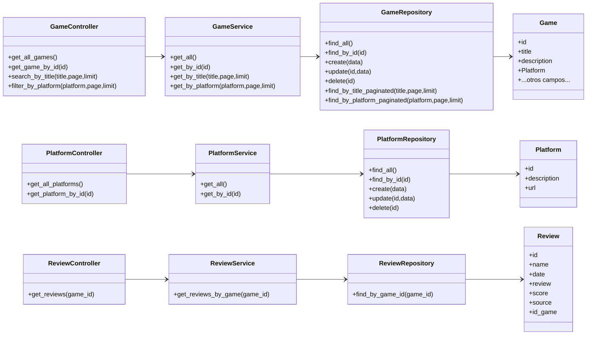
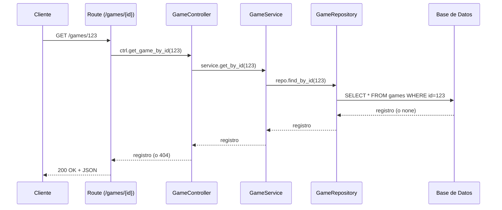

# Documento de Diseño

Este documento describe el diseño de la API, incluyendo diagramas de clases, secuencias, flujo de solicitud, y diseño lógico/​físico de base de datos.

---

## 🧩 1. Arquitectura general

La aplicación está construida con **FastAPI** y sigue una arquitectura en capas:

- **Routes**: definen los endpoints REST y manejan dependencias.
- **Controllers**: contienen la lógica de aplicación (validaciones básicas) y orquestan servicios.
- **Services**: implementan la lógica de negocio y formateo de respuestas (como paginación).
- **Repositories**: acceden a la base de datos usando **SQLAlchemy Async**.
- **Models**: mapeo ORM de las tablas de la base de datos.
- **Schemas (Pydantic)**: definen los contratos de entrada/salida JSON.

---

## 📦 2. Diagrama de clases (estructura estática)

---

## 🧭 3. Diagrama de secuencia (ejemplo: GET /games/{id})

---

## 🔁 4. Flujo de solicitud (general)

1. **Cliente** realiza petición HTTP.
2. **FastAPI Router** selecciona endpoint y resuelve dependencias (`get_db`, `get_controller`).
3. **Controller** recibe request y aplica validaciones iniciales (ej. 404/400).
4. **Service** ejecuta lógica de negocio y formatea respuesta (paginación, transformaciones).
5. **Repository** ejecuta consultas SQL (Async SQLAlchemy) y retorna filas.
6. **Controller** retorna datos al cliente (FastAPI serializa con Pydantic).

---

## 🗃️ 5. Diseño lógico de la base de datos

### Tablas principales

#### `games`
- **id** (PK, autoincrement)
- title (varchar)
- description (text)
- GameDBId (int)
- image_Large, image_Medium, image_Original, image_Front (varchar)
- Platform (varchar)  ← valor usado para filtrar
- Publisher (varchar)
- releasedate (varchar)
- players (varchar)
- genre (varchar)
- youtube_Trailer, youtube_Walk, youtube_ending, youtube_secrets, youtube_ost, youtube_speedrun, youtube_review (varchar)
- wiki_url (varchar), wiki_page (text)
- spotify_ost (varchar)
- ign_url, metacritic_url, three_d_juegos_url, areajugones_url, meristation_url, opencritic_url (varchar)
- metacritic_score, metacritic_scoreu, three_d_juegos_score (varchar)
- esrb_letter, esbr_message (varchar)

#### `platform`
- **id** (PK, autoincrement)
- description (varchar, NOT NULL)
- url (varchar, NULL)

#### `review`
- **id** (PK, autoincrement)
- name (varchar)
- date (varchar)
- review (text, NOT NULL)
- score (varchar)
- source (varchar, NOT NULL)
- id_game (FK -> games.id, ON DELETE SET NULL, ON UPDATE CASCADE)

### Relaciones lógicas
- `review.id_game` referencia `games.id`
- No hay relaciones ORM declaradas (ningún `relationship`), pero la FK existe a nivel de DB.

---

## 🧱 6. Diseño físico de la base de datos (MySQL/MariaDB)

### Configuración de conexión
- Motor: `mysql+aiomysql`
- Pool (en `app/database.py`):
  - `pool_size=10`
  - `max_overflow=20`
  - `pool_pre_ping=True`

### Variables de entorno usadas
- `DB_USER` (default `admin`)
- `DB_PASSWORD` (default `password`)
- `DB_HOST` (default `192.168.1.13`)
- `DB_NAME` (default `game`)

### Estrategia de sesiones
- Uso de `AsyncSession` con `expire_on_commit=False`.
- Dependencia `get_db()` garantiza cierre de sesión tras cada request.

---

## 🧠 7. Consideraciones de diseño y extensibilidad

- **Capas desacopladas:** facilita el reemplazo de la capa de persistencia (e.g., cambiar de MySQL a PostgreSQL) sólo ajustando repositorios.
- **Paginación** implementada en el servicio (`GameService`) y SQL en el repositorio.
- **Validaciones minimalistas:** actualmente solo existen controles básicos (404, 400). Se puede ampliar con validaciones de esquema, autenticación/roles y manejo de errores centralizado.
- **Escalabilidad:** la arquitectura permite añadir nuevas entidades y endpoints con patrón similar (route → controller → service → repo).

---

## 📌 Notas finales
Este diseño refleja el estado actual del código. Para diagramas más detallados (ej. plantillas UML completas o diagramas ER detallados), se puede usar una herramienta externa (draw.io, PlantUML, dbdiagram.io) y exportar a imagen.
